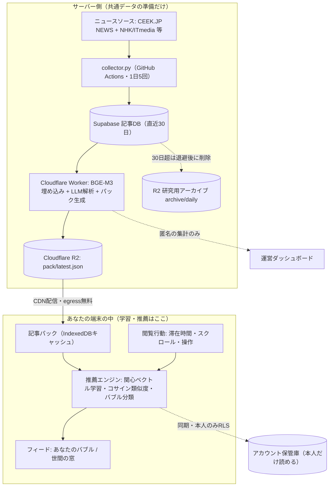

# OwnNews — 情報的健康を保つ、ローカルファーストなニュースリーダー

> **推薦のエンジンはあなたの端末の中に。嗜好データは個人に帰属し、運営は匿名の集計だけを観測する。**

OwnNews は、ニュースを「食事」になぞらえて情報摂取のバランスを可視化し、フィルターバブルの外側にも自然に触れられるニュースリーダーです。一般的なニュースアプリと異なり、**推薦アルゴリズムをサーバーではなくユーザーの端末（ブラウザ）に置く**ことで、プラットフォーム側に嗜好情報を集中させずに、本人が情報摂取をコントロールできる体験を研究しています。

荒川研究室による研究プロジェクトであり、すべて**無料枠内で恒久運用**できるよう設計されています。

- 🌐 サービス紹介: [`/welcome`](https://ownnews-web.pages.dev/welcome)
- 🧮 アルゴリズム全公開: [`/algorithm`](https://ownnews-web.pages.dev/algorithm)
- 📮 運営者情報・掲載停止窓口: [`/about`](https://ownnews-web.pages.dev/about)

---

## 0. Design Philosophy — Client-Side Recommendation

ふつうのニュースアプリでは、推薦をサーバーで行うために、ユーザーの閲覧履歴・嗜好情報をサーバーに蓄積する必要があります。OwnNews はこの構造を反転させます。

- **サーバーの仕事は「全員に共通の記事データを準備して配る」ところまで。**
- **関心の学習と推薦の計算は、すべて端末の中**（ブラウザ / IndexedDB）で行われます。
- アカウントに同期されるのは端末間で引き継ぐためのデータで、**本人以外は読めません**（Row Level Security）。運営が観測できるのは**匿名の集計だけ**です。

この「推薦の主導権をユーザーに」という思想の実践として、使っているアルゴリズムのしきい値・計算式を [`/algorithm`](https://ownnews-web.pages.dev/algorithm) で実装値そのままに公開しています。

---

## 1. System Architecture



### 1.1 Components

| レイヤ | 技術 | 役割 |
|---|---|---|
| **収集** | Python (`collector.py`) on **GitHub Actions** | RSSから記事メタデータを収集。1日5回。ソースへの礼儀としてホスト別に間隔制御＋素性明示 User-Agent |
| **記事DB（共有）** | **Supabase** (PostgreSQL + pgvector) | 記事メタデータ・埋め込み・匿名の集計のみ。直近30日を保持 |
| **AI処理** | **Cloudflare Worker** (`article-processor`) | 埋め込み生成・LLM解析・記事パック生成・日次アーカイブ・retention・Push送信 |
| **配信** | **Cloudflare R2** ＋ `/api/pack` | 記事パック（メタデータ＋量子化埋め込み）をCDNキャッシュ付きで配信。egress無料 |
| **フロント / 推薦エンジン** | **Next.js 15** (App Router, Edge) on **Cloudflare Pages** | 推薦計算はすべてブラウザ内。IndexedDBが高速表示キャッシュ |
| **アカウント保管庫** | **Supabase** (per-user, RLS) | 関心ベクトル・設定・操作履歴を本人だけが読み書き（端末間同期用） |

### 1.2 Data Pipeline

1. **収集 (Ingestion)** — `collector.py` が [CEEK.JP NEWS](https://news.ceek.jp/) の13カテゴリフィードと、NHK・ITmedia・Impress Watch・GIGAZINE・東洋経済オンライン・CNET Japan の公式RSSを取得。CEEK はバースト的アクセスを弾くため、**ホスト別レート制御（CEEKへは10秒間隔＋ゆらぎ）・空振りリトライ・問い合わせ先入り User-Agent** で配慮しつつ、取りこぼしを防ぎます。
2. **埋め込み (Vectorization)** — 多言語モデル **`@cf/baai/bge-m3`** で **1024次元ベクトル**に変換。
3. **解析 (Analysis)** — LLMが各記事に「栄養素」5指標・中分類・キーワードを付与（下記 §2.2 / §3）。
4. **パック生成 (Distribution)** — Worker が収集サイクルごとに直近 **800件** の記事パック（メタデータ＋int8量子化埋め込み＋匿名の閲覧数/リアクション集計＋話題キーワード）を生成し **R2** の `pack/latest.json` に書き出し。`/api/pack` がCDNキャッシュ付きで配信します。埋め込みの一括読み出しはDB負荷が高いため、**旧パックから再利用する増分方式**で生成します。
5. **保持 (Retention)** — 記事DBは**直近30日分のみ**保持。それより古い日は、まず研究用アーカイブ `archive/daily/YYYY-MM-DD.json`（R2）へ**完全性を確認してから**退避し、その後DBから削除します（アーカイブが揃わない限り削除しません）。
6. **観測 (Observation)** — 運営は `is_admin()` で保護された集計RPC経由で、利用者数・バブルの形・記事母集団などの**匿名集計のみ**を観測できます。

### 1.3 Free-Tier Sustainability

| 要素 | サービス | 無料枠に対する考え方 |
|---|---|---|
| 収集 | GitHub Actions（publicリポジトリ） | 分数無制限 |
| LLM解析 | さくらのAI Engine（無償3,000req/月）＋ Groq ＋ Workers AI | バッチ処理で月間リクエストを抑制。3段フォールバックで無停止 |
| 埋め込み | Workers AI（BGE-M3） | 軽量 |
| 記事DB | Supabase 500MB | 30日 retention ＋ R2アーカイブで定常サイズを維持 |
| 配信 | R2 10GB・egress無料 | パック約1〜2MB。ユーザー数が増えてもコスト不変 |
| 推薦計算 | ユーザーの端末 | サーバー負荷ゼロ |

---

## 2. AI / LLM Stack

嗜好の学習はローカルですが、**全員共通の「記事の下ごしらえ」**（埋め込み・栄養素スコア・分類）はサーバー側のAIが担います。

### 2.1 解析チェーン（3段フォールバック）

品質・耐障害性・無料維持を両立するため、解析は3段構成です。どの段でも同じ検証フィルタ（分類の許可リスト・キーワードの抽出制約・スコアのクランプ）を通してから採用します。

| 優先度 | モデル | 提供 | 備考 |
|---|---|---|---|
| **主力** | **gpt-oss-120b** | さくらのAI Engine（国産・無償3,000req/月） | リクエスト数課金のためバッチ12件でまとめて解析 |
| フォールバック1 | **Llama-3.3-70b-versatile** | Groq | さくら失敗時 |
| フォールバック2 | **Llama-3.1-8b-instruct-fp8** | Cloudflare Workers AI | 最終段 |

> 埋め込みモデルは全段共通で **`@cf/baai/bge-m3`**（多言語・1024次元）。

### 2.2 Information Nutrient Scoring（情報の栄養素）

情報の「栄養価」を5軸で数値化します（各0〜100）。

- **事実 (Fact / タンパク質)** — 客観データ・5W1Hの明確さ。
- **背景 (Context / 炭水化物)** — 背景情報・歴史的経緯・「なぜ」。
- **視点 (Perspective / ビタミン・ミネラル)** — 多角的な視点・賛否。
- **感情 (Emotion / 脂質)** — 感情的な訴求・ドラマ性。
- **速報 (Immediacy / 水分)** — 鮮度・緊急性。

ダッシュボードでは、読んだ記事の栄養素平均をレーダーチャートで可視化します。

---

## 3. Recommendation Engine（すべて端末内）

### 3.1 関心ベクトルの学習

あなたの関心は、記事と同じ1024次元の **関心ベクトル1本** で表され、記事を読むたびに指数移動平均で更新されます。

```
v ← normalize( (1−α)·v + α·e )   … 読んだ記事の方向へ α だけ近づく
v ← normalize( v − 0.15·e )       … 「興味なし」の記事から遠ざかる
```

学習率 α は「どれだけ真剣に読んだか」で決まります（開いただけでは学習しません）。

| 行動 | α |
|---|---|
| 開いてすぐ閉じた（5秒未満） | 0（学習しない） |
| ざっと見た（5〜15秒） | 0.06 |
| 読んだ（15〜40秒） | 0.12 |
| じっくり読んだ（40〜120秒） | 0.20 |
| 熟読（120秒以上） | 0.25 |
| ＋最後までスクロール | +0.05（上限 0.3） |
| 「もっと知る」でAIに深掘り | 0.25 |
| ストックした | 0.15 |
| 興味なし（×） | −0.15（遠ざかる） |

初期ベクトルはオンボーディングで選んだカテゴリの記事埋め込み平均から生成します。X・はてなブックマークを開いた記録は保存しますが、**推薦学習には使いません**（意見のバブルを作らないため）。

### 3.2 フィードの組み立て

- **あなたのバブル** — 全記事との**コサイン類似度**が **0.65以上** の記事を類似度順に最大 **15件**。類似度 **0.88以上** の記事同士は「同じ話題」として1枚のカードに集約します。
- **世間の窓（バブルの外）** — 類似度0.65未満の記事を、**「世間の窓」スコア＝閲覧数 ＋ リアクション数×3** の高い順に並べ、さらに全ジャンルから交互に取り出して偏りをなくします（＝あなた以外の人がよく読み・反応している記事が、ジャンル均等に並ぶ）。
- **視野の広さスライダー** — バブルの外の初期表示量 `round(15 × S)` を制御。サーバー往復なしで即時再計算されます。
- **トピック別ビュー** — ジャンルごとのセクション表示。偏食予防のためセクション順は訪問ごとにシャッフルし、各セクションの1枠は注目上位圏外からランダムに選ぶ **🎲 セレンディピティ枠**。

### 3.3 能動的な情報摂取

「まんべんなく」だけでなく「見たいものを確実に見る」も情報的健康の一部です。

- **ウォッチタグ（📌）** — 記事のキーワードや検索語を購読すると、そのタグを含む記事がトップの専用枠に必ず表示されます。購読/解除の履歴は「関心の変遷」として本人のアカウントに記録されます（推薦学習には使いません）。
- **キーワード検索** — 端末にキャッシュ済みの記事を全文一致検索（**検索語はサーバーに送信しません**。回数のみ匿名集計）。
- **話題のキーワード** — TF-IDF的な発想で、**リフト（直近24時間の出現率 ÷ 過去7日の平常時出現率）× 注目度（閲覧数・リアクション）** で「今日特有かつよく読まれている語」を抽出（毎日出る定常語はリフト≒1で除外）。Worker が算出しパックに焼き込みます。

---

## 4. Privacy & Data Model

| データ | 置き場所 | 誰が読めるか |
|---|---|---|
| 記事メタデータ・埋め込み | 共有Supabase / R2パック | 全員（個人情報なし） |
| 関心ベクトル・設定・操作履歴 | アカウント保管庫（Supabase, per-user） | **本人のみ**（RLS: `auth.jwt()->>'email' = user_id`） |
| 高速表示キャッシュ | ブラウザ IndexedDB | その端末のみ |
| 匿名の閲覧数・リアクション集計 | パックに焼き込み | 全員（誰が読んだかは含まない） |

- 推薦計算はサーバー側で一切行いません。サーバーは学習済みベクトルを**端末間同期のために保存するだけ**です。
- 運営ダッシュボード（`/admin`）の集計RPCは `is_admin()` ＋ SECURITY DEFINER で保護され、表示は**匿名ID**に加工されます。
- Google ログインはユーザー識別と端末間同期のためだけに使います。

---

## 5. Feature Highlights

- 🥗 **情報的健康ダッシュボード** — 多様性スコア・栄養バランス（レーダー）・ジャンルバランス・「見落としているかも」・あなた vs 全体・注目キーワード（タグクラウド）・記事母集団。
- 🫧 **フィルターバブルの可視化と制御** — 視野スライダー・世間の窓・トピック別ビュー・セレンディピティ枠。
- 💬 **リアクション（6種）** — 賛成/反対/驚き/学び/疑問/視点が広がった。匿名集計のみで、**推薦には使いません**。
- 🔎 **もっと知る** — 外部AI（ChatGPT / Claude / Perplexity）への深掘り、X検索・投稿、はてなブックマークのコメント表示を1つのパネルに統合。
- 🔔 **Web Push（毎朝1回）** ＋ **PWAオンボーディング** — 端末に応じて「ホーム画面に追加 / アプリを追加 / ブックマーク」＋通知を初回に案内。
- ⚖️ **著作権配慮** — 見出し・短い抜粋・小さなサムネイル・出典を表示し、本文は必ず配信元へ誘導（著作権法47条の5の枠組み）。掲載停止窓口を `/about` に明示。
- 🔬 **運営ダッシュボード** — 利用者数・バブルのヒートマップ/レーダー・フィルタ強度分布・関心キーワード・記事母集団など、匿名集計の観測用。

---

## 6. Repository Structure

```
OwnNews/
├── collector.py                 # RSS収集（GitHub Actions・複数ソース・ホスト別レート制御）
├── supabase/migrations/         # 共有Supabaseのマイグレーション（supabase db push で適用）
├── schema.sql, migrate_*.sql    # 初期スキーマ・過去のマイグレーション
├── workers/article-processor/   # Cloudflare Worker（埋め込み・LLM解析・パック生成・retention・Push）
│   └── src/index.ts
└── web/                         # Next.js 15 アプリ（Cloudflare Pages）
    └── src/
        ├── app/                 # ルーティング（/ ダッシュボード /admin /welcome /algorithm /about）
        ├── components/          # UI（フィード・レーダー・タグクラウド・運営可視化 等）
        └── lib/client/          # 推薦エンジン（engine.ts）・同期（sync.ts）・store 等
```

---

## 7. Deployment / Operations

すべて無料枠。おおまかなセットアップ順序:

1. **共有Supabase** — `schema.sql` を起点に、`supabase/migrations/` を **`supabase db push`** で適用。
2. **R2** — Cloudflare Dashboard でバケット `ownnews-pack` を作成。
3. **Worker** — `cd workers/article-processor && npx wrangler deploy`。Secrets: `SUPABASE_URL` / `SUPABASE_KEY`、任意で `SAKURA_API_KEY`・`GROQ_API_KEY`・VAPID鍵。R2バインディング `PACK_BUCKET` → `ownnews-pack`。
4. **Web** — `main` への push で `deploy.yml` が Cloudflare Pages に自動デプロイ（Pages 側に R2 バインディング `PACK_BUCKET` を設定）。
5. **収集** — GitHub Actions の `Collect News`（`collect.yml`）を有効化（60日無活動による自動無効化を防ぐ keepalive 組み込み済み）。

> 秘密鍵（VAPID秘密鍵・各APIキー・Supabaseキー）は Wrangler Secrets / GitHub Secrets で管理し、リポジトリには含めません。

---

## 8. News Sources & Copyright

- 記事は **[CEEK.JP NEWS](https://news.ceek.jp/)** 様のRSSと、各報道機関の公式RSSから収集しています。ニュース検索サイトのご協力に感謝いたします。
- 本サービスは所在検索・情報解析サービス（**著作権法第47条の5**）の枠組みで、見出し・短い抜粋・小さなサムネイル・出典を表示し、**本文は必ず配信元で読んでいただく**設計です。栄養素等の指標はAIによる情報解析（**第30条の4**）の結果です。
- 各記事の著作権は、それぞれの報道機関・配信元に帰属します。掲載停止・削除のご依頼は [`/about`](https://ownnews-web.pages.dev/about) の窓口へ。

---

## 9. Acknowledgments

本研究は，科学研究費補助金（**JP23H00216**）ならびに JST ERATO（**JPMJER2502**）の支援のもと実施されています。
また、ニュースソースとして **[CEEK.JP NEWS](https://news.ceek.jp/)** 様のRSSフィードを利用させていただいております。ここに記して感謝申し上げます。

---

## 10. Disclaimer

This project is a research prototype. AIによる解析結果の正確性は保証されません。各ニュースソースの利用規約を遵守してください。
